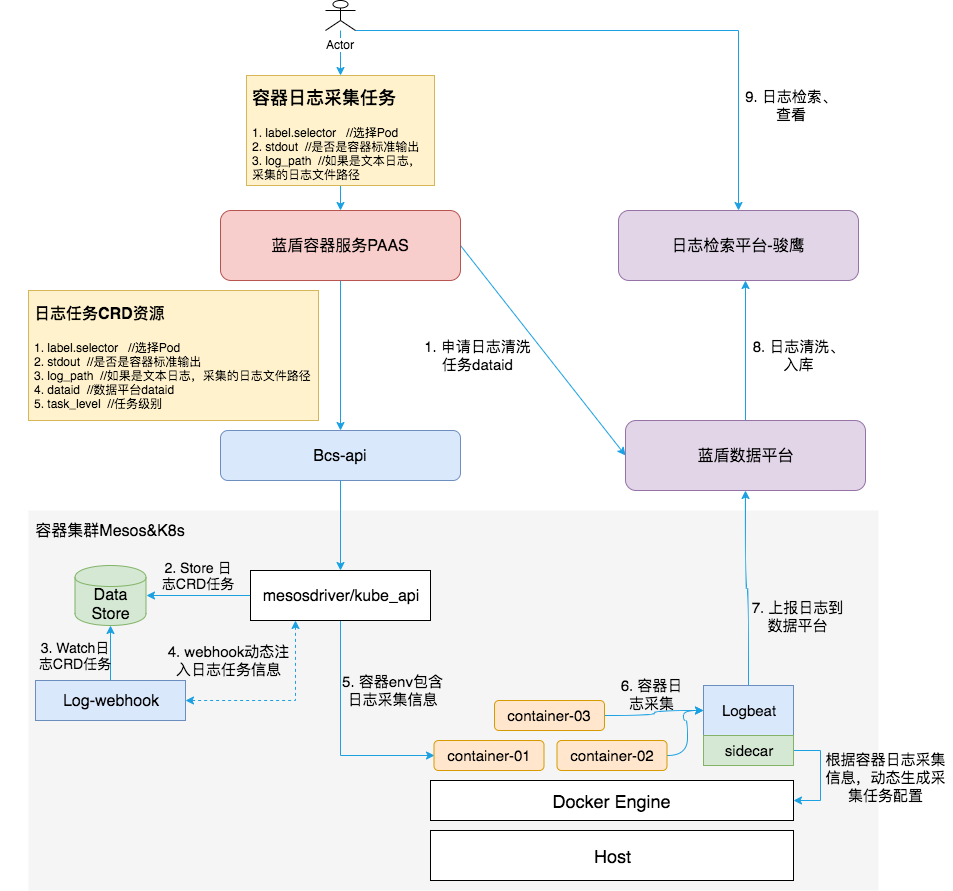
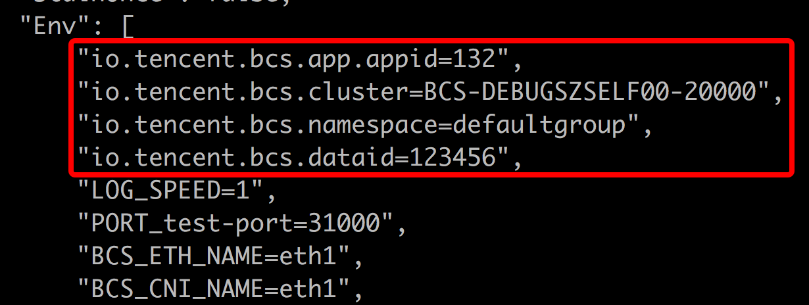

# bcs容器日志解决方案
## 背景
容器技术在部署、交付阶段给人们带来了非常大的便利，但是在日志处理阶段带来了一些新的挑战，包括：
1. 容器日志默认是打到容器里面的，容器的生命周期较短，创建、销毁是非常常见的事情，当容器被销毁后容器日志随之被销毁，因此需要一种技术来持久化的保存日志
2. 容器的到来让微服务更加容易落地，它为系统带来松耦合的同时引入了更多的组件。因此我们需要能够快速的定位问题以及还原日志上下文关系。

## 容器日志分类
容器产生的日志大部分可以归结为两类：标准输出和文本文件

### 标准输出
容器内的进程默认将日志打到stdout、stderr，容器技术默认使用json-file logging driver将此种类型的日志以json的格式写入宿主机文件中，目录格式如下：
/var/lib/docker/containers/<container-id>/<container-id>-json.log，此种方式的日志可以通过docker logs <container_id>查看。

针对这种方式的日志文件，可以在宿主机上面收集、上报。

### 文本日志
默写进程会将进程日志打印到特定的目录下，而并没有将日志重定向到容器的标准输出中。例如：tomcat将日志打印到catalina.log、access.log、manager.log、host-manager.log中。
此种类型的文件日志同样可以基于一些特定的规则，在宿主机上面找到相应的目录，进而能够在宿主机上面完成采集、上报。

如下lb的容器将日志打到了容器内的/bcs-lb/logs/bcss-loadbalance.log文件。


此日志文件会以规则/proc/<container pid>/root/bcs-lb/logs/bcss-loadbalance.log打到宿主机上面。


## bcs容器日志方案
通过上面对于容器日志的分类以及容器日志能在宿主机上面索引到的特性，bcs将在每台物理机上面通过daemonset的方式部署日志采集插件-logbeat，进而能够较为友好的方式采集容器日志。
基于bcs对于CRD资源的支持，用户可以自定义日志采集任务，并通过将bcs容器日志采集与蓝鲸数据平台打通，实现日志采集、日志清洗、日志查询完整的容器日志方案。



### 功能特点
bcs容器日志方案包含如下功能：
1. 支持通过CRD(CustomResourceDefinition)方式进行日志采集配置的管理（包括：标准输出、文本日志）
2. 与蓝鲸数据平台打通，自动创建日志清洗任务、清洗规则
3. 对业务容器零入侵，通过webhook特性自动注入容器日志采集信息
4. 采集数据自动打标，即对收集上来的日志自动加上pod id、container id、文件路径等用于标识数据源的信息
5. 通过DaemonSet方式，自动完成日志采集器logbeat部署
6. 同时支持mesos、kubernetes两种容器方案

### 日志采集任务CRD资源定义
```
apiVersion: bkbcs.tencent.com/v2
kind: BcsLogConfig
metadata:
  # your config name, must be unique in you container cluster
  name: stdout-example
spec:
  # 配置类型，可选项。如果配置这个参数，可选值standard, bcs-system
  configType: standard
  # whether container stdout
  stdOut: false
  # when stdout=false, logpath is log path
  logPath: bcs-lb/logs/bcss-loadbalance.log
  # dataid
  dataId: "20001"
  # appid
  appId: "10001"
  # clusterid
  clusterId: bcs-k8s-10001
  # 所需注入日志配置的容器的名字
  containers:
    - istio-proxy
    - clb-sidecar
```
- configType: log配置的类型，可选项。如果配置这个参数，可选值为standard, bcs-system
- stdOut: 如果需要采集容器标准输出则为true，采集文本日志则为false
- logPath: 当采集文本日志时，需要采集的日志文件目录
- dataId: 数据平台日志清洗任务dataid，logbeat上报数据平台需要
- appId: 应用id
- clusterId: 集群id
- containers: 所需注入日志配置的容器的名字。当配置了configType时，该参数不用填写。

具体实现可参考 [bcs-log-webhook-server 文档](./bcs-log-webhook-server.md)

### 采集器logbeat&sidercar
logbeat是蓝鲸内部通用的采集物理机日志的采集器，拥有非常高的稳定性以及性能。但是由于容器随时创建、随时销毁等特性，logbeat不能直接采集容器日志。
sidecar通过动态生成logbeat日志采集配置，能够实现容器日志的采集。
sidecar包含如下功能：
1. 支持容器自动发现，通过docker api接口实时发现容器的创建、销毁情况
2. 根据容器日志类型，自动生成日志文件在宿主机的文件目录
3. 通过容器env中包含的日志采集信息，动态生成logbeat日志采集配置

容器env中包含日志采集信息


logbeat日志采集配置
```json
{
    "tlogcfg": [
      {
        "file": "/data/bcs/docker/lib/docker/containers/ba2d22b78d677d028ba705b4f199b820cfa993ac8bb29d1d29ed84d2cc69bc57/ba2d22b78d677d028ba705b4f199b820cfa993ac8bb29d1d29ed84d2cc69bc57-json.log",
        "dataid": "20001",
        "private": [
          {
            "container_id": "ba2d22b78d677d028ba705b4f199b820cfa993ac8bb29d1d29ed84d2cc69bc57",
            "io_tencent_bcs_app_appid": "10001",
            "io_tencent_bcs_app_cluster": "bcs-k8s-10001",
            "io_tencent_bcs_app_namespace": "defaultgroup"
          }
        ],
        "field_sep": "|",
        "fileds": [],
        "beJson": 1
      }
    ]
}
```

### 自动注入容器日志采集信息
采集器sidecar需要容器的env中包含上述所说的一些日志采集信息，为了尽量减少对业务yaml的侵入型，基于bcs的webhook机制实现容器env信息的自动注入。
容器env注入信息如下：
- io_tencent_bcs_app_appid   //业务appid
- io_tencent_bcs_app_stdout //是否是标准输出
- io_tencent_bcs_app_logpath //文本日志时的日志目录
- io_tencent_bcs_app_cluster //集群id
- io_tencent_bcs_app_namespace //namespcae

具体实现可参考 [bcs-log-webhook-server 文档](./bcs-log-webhook-server.md)