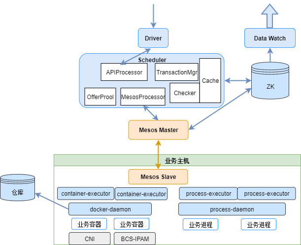

# 基于mesos的服务编排调度

Mesos是Apache下的开源分布式资源管理框架，它被称为是分布式系统的内核，其核心功能是集群资源的管理。在mesos提供的接口基础上，我们通过开发适合服务编排调度需求的mesos framework和mesos executor等功能模块，实现了BCS中基于mesos的容器的调度管理，并根据实际情况支持容器和进程进程混合编排。

## 系统架构

基于mesos的调度管理的系统结构及概要说明如下：



* Mesos包括Mesos Master和Mesos Slave两大部分，其中Master为中心管理节点，负责集群资源调度管理和任务管理；Slave运行在业务主机上，负责宿主机资源和任务管理。
* Mesos为二级调度机制，Mesos本身只负责资源的调度，业务进程的调度需要通过实现mesos framework（图中scheduler）来支持，同时需实现执行器executor（mesos也自带有executor可以直接使用）来负责容器的起停和状态检测上报等工作。
* Mesos（Master和Slave）将集群当前可以的资源以offer（包括可用CPU,MEMORY,DISK,端口以及定义的属性键值对）的方式上报给scheduler，scheduler根据当前部署任务来决定是否接受offer，如果接受offer，则下发指令给mesos，mesos调用executor来运行容器。
* Scheduler为容器编排调度的核心模块，主要负责将用户定义的应用以容器或者进程的方式运行在合适的机器上，并维护其生命周期。
* Container Executor负责执行容器的启动销毁已经整个生命期，为了进程容器进程混合编排，我们实现了Process Executor和Process Daemon。
* Driver主要负责用户接口转换，DataWatcher主要负责集群内资源向BCS服务层同步。
* Mesos master 和 Mesos Framework（scheduler）都采用master-slave的方式进行多实例部署。通过ZooKeeper进行服务状体同步和服务发现。
* Mesos Scheduler的数据存储在ZooKeeper中
* Scheduler内部主要以以下模块：APIProcessor主要负责用户接口消息的处理；MesosProcessor主要负责和Mesos的通信；Offerpool维护当前集群可以资源的管理；TransactionMgr负责事务管理；Checker负责定时检测；Cache主要做数据缓存提升系统性能。

## 调度对象

在分布式系统中，一个业务通常由多个不同功能模块组成，我们把每一个功能模块称之为一个应用（application）。而在一个应用中，通常会部署多个功能相同的进程组以达到性能和可靠上等方面的保障，我们将一个进程组称之为一个taskgroup。而具体到进程组，通常由一个或者一个以上的具有紧密逻辑关系的进程（task）组成。
以上关系可以通过以下例子说明：
游戏服务中通常会包括gamesvr，snssvr，loginsvr等不同的application，其中每个application部署多个不同的实例（taskgroup），例如gamesvr-1， gamesvr-2等等。而每个gamesvr taskgroup内，由gamesvrd和connsvrd两个不同的进程（task）组成。
同一个taskgroup内的task通常部署在相同的主机，同时被创建，同时被销毁，每个task具有独自的启动命令和参数，环境变量，磁盘挂载，镜像，网络端口和资源占用配额等属性，并且运行在独立的容器（container）中，所以task是运行的最小单元，但通常taskgroup才是调度的最小单元，而application是用户部署时的操作对象。
实际使用中，用户通常是先定义好一个application(包括namespace，name，taskgroup的个数以及taskgroup和task的具体属性，这里不做详细说明)，然后调用create，scale，update，delete等接口对application进行部署操作。scheduler在具体执行过程中，通常以taskgroup为粒度进行实际调度。

## 调度流程

前面已经介绍了application及其与taskgroup，task对象的关系，当用户需要部署（以及更新，重新调度，扩容）一个application时，大体流程如下：
* 1： 用户根据规则定义application/deployment，然后调用scheduler的接口进行操作请求；
* 2： Scheduler收到操作请求后，创建一个编排事务（transaction），加入到事务队列；
* 3： Mesos master 不断上报集群资源信息（offer，包括CPU,Memory,Disk,端口等信息），Scheduler将其放入offerpool进行管理；
* 4： Scheduler对每一个编排事务进行检测，当有合适的资源可用时，则部署相应的实例到集群机器上；
* 5： Mesos收到Scheduler下发的部署taskgroup后，调用executor启动容器并上报所有task的状态，一个taskgroup部署完成
* 6： 用户对应用进行滚动升级，扩缩容等操作，以及系统内部检测到某个taskgroup异常退出等情况下，也会触发相应的编排事务。


## 重新调度

除了用户操作application时scheduler需要调度taskgroup实例，在application运行过程中的某些情况下，系统也需要自动触发重新调度taskgroup，如：
* taskgroup异常退出
* taskgroup所在主机mesos slave和mesos master失去联系，导致scheduler无法对该taskgroup进行管理
* taskgroup在运行中，但健康检查出现异常
* 其他

针对各种异常情况，我们支持各种异常情况下对运行的taskgroup实例进行重新调度，可以配置重新调度的时机，最大次数和间隔等，说明如下：
* policy：支持Never Always OnFailure三种配置(默认为OnFailure),OnFailure表示在失败的情况下重新调度,Always表示在失败和Lost情况下重新调度, Never表示任何情况下不重新调度。目前尚未支持health check触发重新调度。
* interval: 失败后到执行重启的间隔(秒),默认为0
* backoff：多次失败时,每次重启间隔增加秒,默认为0.如果interval为5,backoff为10,则首次失败时5秒后重新调度,第二次失败时15秒后重新调度,第三次失败时25秒后重新调度
* maxtimes: 最多重新调度次数,默认为0表示不受次数限制.容器正常运行30分钟后重启次数清零重新计算


## 调度约束

上面我们介绍了application的操作流程和taskgroup的重新调度流程，其核心逻辑是用户操作（也可能为系统自身触发的重新调度等操作）和mesos offer匹配的过程。我们在调度taskgroup时，除了对系统主机CPU,memory，disk，port等基本资源有要求外，通常还有各种不同的要求，例如需要部署（或者不部署）在指定的IDC和机型，需要在多个网段分散部署，一台主机最多n个实例等等，我们把这些和系统基本资源无关的要求称之为调度约束规则。
我们把约束抽象成属性，算法和参数（可选）三部分：
* 属性： 通常情况下是主机的一个属性，例如所属IDC，主机类型，运营商类型，主机名，内网IP，外网IP等. 
* 算法： 即针对属性需要满足的规则，例如 匹配（LIKE）, 不匹配（UNLIKE），均匀分布，唯一分布等
* 参数： 支持算法计算的参数，例如 上海南汇(属性为IDC)， 172.10.1.*（属性为内网IP）......
通过以上抽象，常用的部署规则都可以比较方便的用统一的形式表达出来；同时，我们也支持多种条件的组合（与和或）。

下面详细介绍约束属性，算法，参数以及约束组合。

#### 调度约束属性
属性通常是指mesos上报集群资源时主机的标签键值对，例如： IDC->上海南汇， InnerIP->172.10.1.23。主机属性可能来源于：
* Mesos Slave启动时从配置或者启动参数中读取，资源上报时记录在offer中；
* Mesos Slave在运行过程中动态获取的属性，在资源上报时记录在offer中，目前尚未支持；
* Scheduler从Mesos之外的途径获取的主机的属性。

#### 调度约束算法

* UNIQUE: 每个实例的属性取值唯一，例如：属性为IDC, 则表示每个IDC只能部署一个实例。UNIQUE算法无需参数。
* MAXPER: 属性同一取值下最多可运行的实例数，为UNIQUE的增强版（可以通过参数指定最多运行的实例数），例如：属性为hostname，参数为2，则表示同一主机上最多运行2个实例。
* CLUSTER: 限定实例部署在属性取值范围内的主机，例如属性为InnerIP, 参数为[172.10.1.2, 172.10.1.3],则表示必须部署在内网IP为172.10.1.2和172.10.1.3的主机上。
* LIKE: 通过字符串匹配的方式约束属性取值范围， 例如属性为InnerIP，参数为"172.10.1.*"，则表示必须部署在内网IP前三段为172.10.1的主机上。
* UNLIKE: LIKE取反。
* GROUPBY: 均匀分布，例如属性为district，参数为["sh","sz",“cd”],则表示需要在三个地区均匀部署实例，如果目标实例为9，则每个地区部署3个实例，如果目前实例为8，则在两个地区各位3个实例，另外一个地区部署2个实例。

#### 调度约束参数
为了支持各种不同的属性和算法，约束参数支持以下几种类型：
* string： 字符串
* set：字符串数组
* scalar： 浮点数
* range： 整型数begin和end

#### 约束组合
一条约束规则的约束能力有限，我们支持多个约束条件的组合：
* 与组合：多个约束条件必须同时满足，例如：应用必须部署在上海电信机房A类机器，并且每台主机最多部署一个实例，这个需要同时满足地区，机型和hostname三个属性的不同约束条件，我们通过与组合方式能很方便的表达出来。
* 或组合：多个约束条件只需满足一个即可，这种情况相比与组合使用的要少，因为很多约束算法的参数中就能在某种成都上表达出这种情况。

## 滚动升级
上面介绍到，一个application为一组具有相同功能的taskgroup实例组成，而不同application中的taskgroup通常情况下没有直接的关系。
很多业务存在运行过程中进行热更新的需求，这样，在某个阶段就会存在一个application的多个版本的实例共存的情况，他们既不是完全独立的application，也不能看成是完全相同的application，因此我们在application的基础上进一步封装了deployment的概念来实现这样的需求。
一个deployment可以将多个具有一定关系（通常是不同版本）的多个application进行关联，以方便实现滚动升级等操作。
deployment定义中自带有application的定义，创建一个deployment的时候会同时创建application，同时销毁deployment的时候也会同时销毁其下的application。
我们也支持定义一个deployment关联到当前已经运行的application而不是创建新的application，方便对application进行滚动升级等操作。
定义一个deployment之后，我们支持对其进行create（创建），delete（销毁），update（滚动升级），rollback（升级回滚），update-pause(暂停更新)，update-resume（继续更新）等操作。对deployment进行操作的目的本质上是对其关联的application进行操作。
对于应用的滚动升级，通过deployment的操作，我们支持以下升级策略：
* 新老实例的操作顺序，killFirst或者startFirst
* 多次滚动的时间间隔，例如，每60秒执行一次滚动
* 每次滚动操作的实例数，例如kill一个老的，start两个新的
* 保持或者调整taskgroup实例数
* 自动或者手动触发每次滚动，例如，每60秒自动执行一次滚动，也可以每执行一次滚动后即暂停，等用户输入指令后再执行下一次滚动

deployment的操作过程，内部实现是通过对application的create，scale up， scale down， delete等几个操作来实现的，只是触发方式由用户触发改为了系统自动触发，这里不再做详细说明。

## 有状态服务的部署方案
对于有状态服务的容器化改造，可以基于application、service来实现。有状态服务一般会有如下特性：
1. 实例有唯一身份标识
对于有N个实例的应用，每一个实例在初识时会被赋予一个int类型的值，从0到N-1，在应用当中是唯一的、不变的。业务容器可以通过env环境变量的方式获取当前实例的index，规则如下：
BCS_POD_ID={INDEX}.{appname}.{namespace}.{clusterid}.{timestamp}，其中{INDEX}则表示这个不变的身份标示id。
2. 实例间需相互发现
对于有状态的服务很多时候需要知道其它实例从而构成集群，例如：zk、consul等。针对这种情况每一个实例都会被分配一个不变的、唯一的域名用来相互之间服务发现，规则如下：
{appname}-{INDEX}.{servicename}.{namespace}.svc
**注意：如果需要使用次特性必须要首先创建service对象**
3. 持久化存储数据
对于有持久化存储需要的服务，可以使用挂载目录的方式实现，挂载到物理机本地或者分布式存储当中。如下所示：
```
"volumes": [{
    "volume": {
        "hostPath": "/data/host/path",
        "mountPath": "/container/path",
        "readOnly": false
    },
    "name": "test-vol"
}],
```
此种方式可以将持久化存储的数据以挂载目录的方式存储到物理机相应目录下，容器重新调度数据依然存在。

### 有状态服务consul部署示例
service
```
{
  "apiVersion": "v4",
  "kind": "service",
  "metadata": {
   "name": "consul-svc",
   "namespace": "test",
   "labels": {
     "BCSGROUP": "external",
     "consul_svc": "consul_svc"
   }
  },
  "spec": {
   "selector": {
    "podname": "consul"
   },
   "ports": [{
    "name": "svc_port",
    "protocol": "tcp",
    "servicePort": 8300
   }]
  }
}
```

application
```
{
	"apiVersion": "v4",
	"kind": "application",
	"updatePolicy": {
		"updateDelay": 10,
		"MaxRetries": 10,
		"maxFailovers": 10,
		"action": ""
	},
	"restartPolicy": {
		"policy": "OnFailure",
		"interval": 5,
		"backoff": 10
	},
	"killPolicy": {
		"gracePeriod": 5
	},
	"constraint": {
	},
	"metadata": {
		"labels": {
			"podname": "consul"
		},
		"name": "consul",
		"namespace": "test"
	},
	"spec": {
		"instance": 3,
		"template": {
			"spec": {
				"containers": [{
					"command": "/bin/sh",
					"args": [
            "-c",
            "mkdir /tls && sleep 3 && exec /bin/consul agent -data-dir=/consul/data -config-dir=/consul/config -server -join consul-0.consul-svc.test.svc -join consul-1.consul-svc.test.svc -join consul-2.consul-svc.test.svc -bootstrap-expect 3  -bind ${BCS_NODE_IP}"
					],
					"parameters": [],
					"type": "MESOS",
					"env": [],
					"image": "consul:latest",
					"imagePullPolicy": "IfNotPresent",
					"privileged": false,
					"ports": [{
						"hostPort": 8300,
						"name": "svc_port",
						"protocol": "TCP"
					}
					],
					"parameters": [],
					"healthChecks": [],
					"resources": {
						"limits": {
							"cpu": "2",
							"memory": "1024"
						}
					},
					"volumes": [
            {
              "volume": {
                  "hostPath": "/data/consul/data",
                  "mountPath": "/consul/data",
                  "readOnly": false
              },
              "name": "consul-data"
            },
            {
              "volume": {
                  "hostPath": "/data/consul/config",
                  "mountPath": "/consul/config",
                  "readOnly": false
              },
              "name": "consul-config"
            }

          ],
					"secrets": [
					],
					"configmaps": []
				}],
				"networkMode": "HOST",
				"networkType": "CNM"
			}
		}
	}
}
```
上面是一个将有状态服务consul部署到容器当中的示例，需要创建application、service两部分资源描述文件，实例间的服务发现使用域名方式：consul-{INDEX}.consul-svc.test.svc；
针对consul中需要持久化存储的数据使用挂载目录的方式存储到物理机目录/data/consul/data。

## 非容器在BCS部署方案
业务的容器化改造是一个先部分容器化，逐步转向全部容器化的过程，bcs支持进程&容器混合编排调度，进而降低了业务容器化改造的成本。
针对非容器的部署方案可以使用process、service来描述业务服务。

如下是使用进程的方式部署mongodb
service
```
{
  "apiVersion": "v4",
  "kind": "service",
  "metadata": {
   "name": "service-mongodb",
   "namespace": "test",
   "labels": {
     "BCSGROUP": "external",
     "mongodb_svc": "mongodb_svc"
   }
  },
  "spec": {
   "selector": {
    "mongodb": "mongodb"
   },
   "ports": [{
    "name": "svc_port",
    "protocol": "tcp",
    "servicePort": 27017
   }]
  }
}
```

process
```
{
    "apiVersion": "v4",
    "kind": "process",
    "restartPolicy": {
        "policy": "OnFailure",
        "interval": 5,
        "backoff": 10,
        "maxtimes": 10
    },
    "killPolicy": {
        "gracePeriod": 10
    },
    "metadata": {
        "labels": {
            "mongodb": "mongodb"
        },
        "name": "mongodb",
        "namespace": "test"
    },
    "spec": {
        "instance": 1,
        "template": {
            "spec": {
                "processes": [{
                    "procName": "mongod",
                    "user": "root",
                    "workPath": "${work_base_dir}/${namespace}.${processname}.${instanceid}/mongodb",
                    "pidFile": "${work_base_dir}/${namespace}.${processname}.${instanceid}/mongodb/mongodb.pid",
                    "ports": [
                        {
						"hostPort": 27017,
						"name": "svc_port",
						"protocol": "TCP"
					}
                    ],
                    "uris": [{
                        "value": "http://xxxxxx/mongodb-v1.tar.gz",
                        "pullPolicy": "IfNotPresent",
                        "outputDir": "${work_base_dir}/${namespace}.${processname}.${instanceid}"
                    }],
                    "startCmd": "./start.sh",
                    "startGracePeriod": 2,
                    "stopCmd": "./stop.sh",
                    "healthChecks": [],
                    "resources": {
                        "limits": {
                            "cpu": "2",
                            "memory": "500"
                        }
                    },
                    "env": [
                        {
                            "name": "hostip",
                            "value": "${hostip}"
                        },
                        {
                            "name": "work_dir",
                            "value": "${work_base_dir}/${namespace}.${processname}.${instanceid}/mongodb"
                        },
                        {
                            "name": "pid_file",
                            "value": "${work_base_dir}/${namespace}.${processname}.${instanceid}/mongodb/mongodb.pid"
                        },
                        {
                            "name": "namespace",
                            "value": "${namespace}"
                        },
                        {
                            "name": "processname",
                            "value": "${processname}"
                        },
                        {
                            "name": "instanceid",
                            "value": "${instanceid}"
                        }
                    ],
                    "secrets": [],
                    "configmaps": []
                }]
            }
        }
    },
    "constraint": {
    }
}
```
详情请参考：[process文档](../../templates/mesos-artifact/process.md)