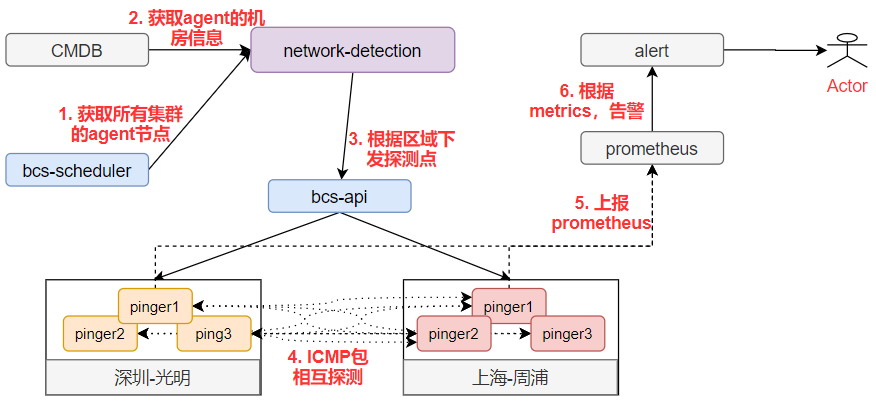

# 背景
容器underlay网络具有网络延迟较低、与物理机网络二层互通等特点，在业务部分容器化改造的实践中有广泛的应用场景。
由于它是在底层网络基建的能力之上建设的，同时也有复杂度高、网络拓扑结构复杂等难点。

bcs承载的业务中存在大量使用underlay网络的场景，能够快速、准确的监控容器基础网络环境是一个必要又基本的能力。

## 容器基础网络探测服务
在主要的网络拓扑节点上埋点，通过ICMP包来探测容器网络是一种较为常用的监控手段。
bcs中的容器集群一般是跨地域、多机房的形式，因此可以在主要的机房埋点（每个机房部署三个探测容器），不同机房之间的埋点容器相互探测。
如果三个探测容器探测某个区域的容器连续失败，则可以初步认为此区域的容器网络有异常。

### 主要特性
1. 同时支持mesos、k8s两种方案
2. 对接prometheus metrics
3. 多个探测点，准确性高

## 改造goldpinger
上图中的pinger服务是在各个物理节点容器化部署的容器网络探测点，它的主要功能是探测其它的探测点，然后将探测结果上报到network-detection。
 [goldpinger](https://github.com/bloomberg/goldpinger)是开源的监控k8s集群中的节点网络连通性的，基于goldpinger可以比较小成本的完成pinger模块。
 
**改造点**
1. 支持bcs mesos部署方案
2. 探测点由从k8s集群中获取，改为支持network-detection下发

